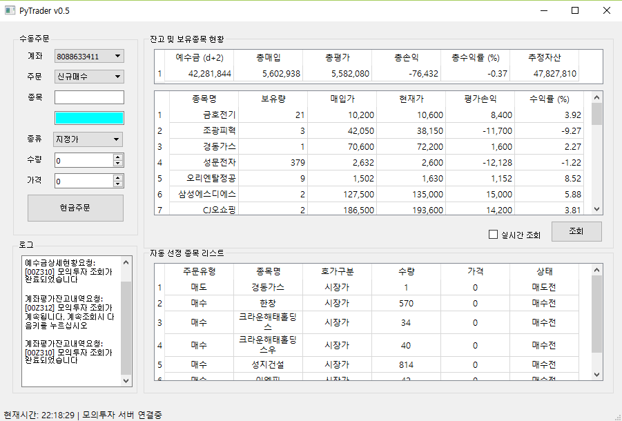

키움 Open API + 를 이용한 시스템트레이딩

## 개발환경
 - Anaconda3-4.3.0.1 32bit (Python 3.6, PyQt5.6, pywinauto, pandas)
 - Windows 7/10

## 로그인설정
 - account.txt에 로그인정보 입력
 - 사용자id
 - 로그인 pw
 - 공인인증서 pw

## 사용법
 - 장 개시 전 매수할 종목을 buy_list.txt에 매도할 종목을 sell_list.txt에 기록.
 - 장 개시 후 pytrader.py를 실행하면 buy_list.txt에 있는 종목을 매수, sell_list.txt에 있는 종목을 매도.

## 딥러닝을 이용한 매수/매도 종목 선정
 - [PyMLT](https://github.com/didw/PyMLT)

## 참고사이트
 - [파이썬을 이용한 시스템 트레이딩(기초편)](https://wikidocs.net/book/110)

